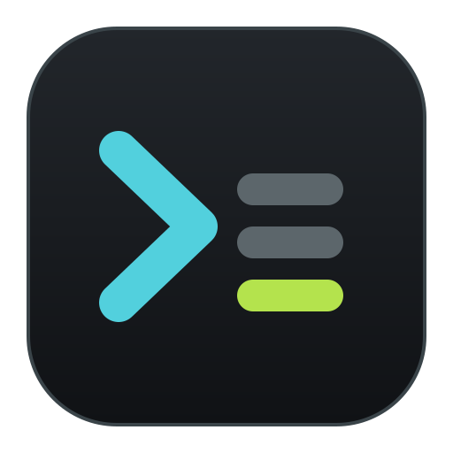
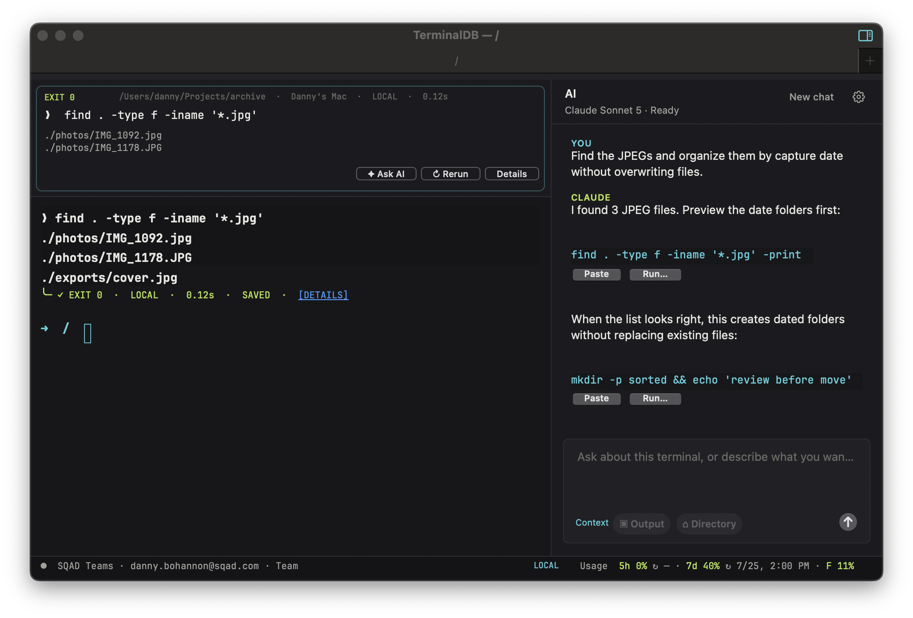
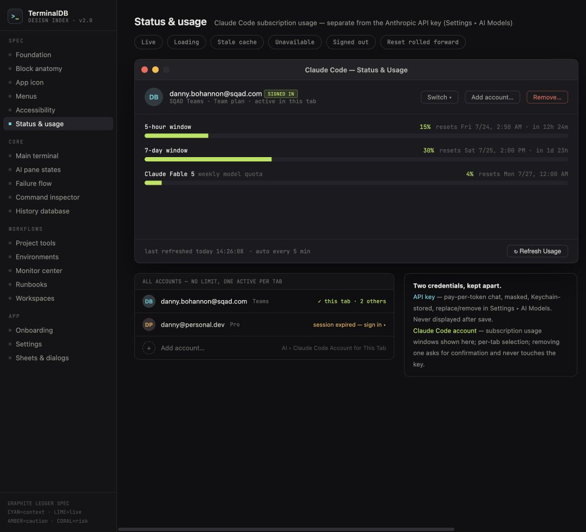

# TerminalDB

<p align="center">
  
</p>

<p align="center">
  <strong>A native macOS terminal with a context-aware Claude assistant and a local command ledger.</strong>
</p>

<p align="center">
  
  
  
  
</p>

<p align="center">
  <a href="https://terminaldb.pages.dev/">Website</a> ·
  <a href="https://github.com/danb235/TerminalDB/releases/download/v0.1.0/TerminalDB-macOS.zip">Download v0.1.0</a> ·
  <a href="https://github.com/danb235/TerminalDB/releases/tag/v0.1.0">Release notes and checksums</a>
</p>

TerminalDB combines an independent PTY-backed shell, a collapsible AI chat,
multiple isolated Claude Code accounts, live subscription-usage tracking, and
a searchable local record of completed commands. It is written directly
against AppKit and macOS system APIs with no Xcode project, package manager, or
runtime framework dependency.

The monorepo also contains TerminalDB Remote v1: a mobile-first React/PWA
controller and a cost-capped AWS serverless ciphertext relay. It provides a
Claude-first session dashboard, terminal control, existing-account switching,
paired-controller management, explicit connectivity states, snapshot resync,
and make-before-break WebSocket rotation. AWS never receives plaintext
terminal or Claude content.

- [Remote architecture](docs/remote-architecture.md)
- [Security and abuse controls](docs/remote-security.md)
- [Deployment, enrollment, and teardown](docs/remote-operations.md)

> [!IMPORTANT]
> TerminalDB is early alpha software. Test it with non-critical workflows,
> review every generated command before running it, and read the
> [security and privacy](#security-and-privacy) section before adding an API
> key.



## Why TerminalDB?

Command-line work often alternates between understanding a system, composing a
command, running it, and interpreting the result. TerminalDB keeps that loop in
one native window:

- The terminal remains a normal interactive shell; natural-language detection
  never intercepts terminal input.
- AI chat receives the current directory and visible terminal output only when
  the user sends a message.
- Suggested shell commands have adjacent **Paste** and permission-gated
  **Run…** actions, so the relationship between command and action is explicit.
- Read-only questions can use a constrained inspection sidecar that reports
  the exact command, output, exit status, and duration.
- Every completed command becomes a structured block with output, target,
  environment, approval, status, timing, bookmarks, and actions.
- AI chat can use either a Claude Code subscription or an Anthropic API key,
  while account identity and usage remain visible and independently managed.

## Features

### Native terminal sessions

- Independent login shell, PTY, working directory, foreground process, and
  scrollback for every tab
- UTF-8, ANSI/256/truecolor output, alternate-screen programs, bracketed paste,
  cursor modes, and xterm navigation keys
- Native macOS windows, tabs, and independent right/down split panes
- In-window control panels for Remote Control, settings, project workflows,
  Claude account usage, and AI provider configuration; dismiss with the visible
  X or Escape without creating another app window
- Event-driven tab titles for shell commands and Claude Code lifecycle states
- Graphite Ledger visual system with bundled JetBrains Mono

### Context-aware AI chat

- Collapsible right-side conversation pane with per-tab context
- Ongoing conversations that survive pane collapse
- **New chat** for a deliberate context reset
- Visible context chips for directory, terminal output, command blocks, and
  monitored work; removable attachments never hide what Claude can see
- Streamed responses from either the Anthropic Messages API or the selected
  Claude Code subscription
- Dynamic API model discovery plus Claude Code model aliases
- Graceful, provider-specific setup and sign-in guidance

### Permissioned command and patch workflow

- Separate inline **Paste** and **Run…** buttons for every shell code block
- Ask-before-running, validated-read-only, and paste-only permission modes
- Risk classification for read-only, unknown, write, destructive, remote, and
  production commands
- Target directory, host, environment, and risk shown before execution
- Production approval requires an acknowledgement and typed target
- Approval metadata recorded with the resulting command block
- Unified diff proposals have **Copy** and **Apply…** actions; apply first runs
  `git apply --check`, supports per-hunk selection, and then enters the normal
  permission flow
- The last approved AI patch remains available for validated reverse-apply
  during the current app session
- Read-only inspection commands run outside the interactive PTY
- Inspection output includes command, directory, exit code, duration, and
  truncation state
- Mutating or unsupported inspections are blocked and returned as suggestions

### Command ledger

- Live **READY**, **RUNNING**, and exit-state header above the terminal
- Current command, directory, inferred environment, exit status, and duration
- Quick **Run again**, **Paste to edit**, **Save as Playbook**, **Details**,
  and **Command History** actions, with secondary tools grouped under **More**
- Search across commands, paths, output, projects, status, date, environment,
  and bookmarks
- In-window inspector with metadata, output, approvals, related history, and
  JSON/text export
- Plain-language search plus simple **All commands**, **Failed**, and
  **Bookmarked** scopes
- Local JSON persistence with bounded records and output
- Best-effort redaction of common API keys, bearer tokens, and password
  assignments before history is written

### Claude Code account management

- No application-imposed account limit
- A different Claude Code account can be selected for each terminal tab
- Add, sign in, switch, and remove profiles without changing another terminal
  application's Claude configuration
- Active account and subscription remain visible in the bottom status strip
- 5-hour, 7-day, and Fable usage with reported reset dates
- Usage refresh on demand and automatically every five minutes
- A dedicated in-window account-and-usage panel keeps the active account, plan,
  sign-in state, all profiles, usage, and reset details separate from API chat

### Workflows and project context

- Monitor Center follows running commands, retains completed output in memory,
  marks commands stalled after three minutes, and notifies on failures or
  commands lasting at least 30 seconds
- Parameterized multi-step playbooks can be created or edited, previewed,
  pasted for review, or sent through permissioned execution
- Workspaces save and restore tabs, splits, directories, Claude Code account
  selection, model, AI-pane state, and conversation context
- Nested split orientation is preserved, and workspaces can be renamed or
  deleted
- Restore conflicts default to opening a new window so current work is kept
- Project Tools provide Git status/diff, file inventory, and test actions
- Environment views explain local, SSH, container/Kubernetes, and production
  protection states
- Private Session keeps the active tab's new command blocks and workspace chat
  context out of persistent storage
- Eight-step first-run onboarding and twelve settings categories



## Project status

TerminalDB is under active development as alpha software. Universal release
builds and the in app updater are automated through GitHub Releases. The
current project does not have Apple Developer ID notarization, a migration
guarantee, or a stable public API.

The design source covers the broader product direction, interaction states,
menus, accessibility behavior, environment safety, history, playbooks, and
monitoring surfaces:

- [Interactive desktop design export](design/desktop/TerminalDB.dc.html)
- [Remote web design notes](design/remote/README.md)
- [App icon SVG master](design/desktop/terminaldb-icon.svg)
- [Claude Design desktop source](https://claude.ai/design/p/0e421271-5e0c-43e1-b34a-e52926506c66?file=TerminalDB.dc.html)
- [Claude Design remote source](https://claude.ai/design/p/0e421271-5e0c-43e1-b34a-e52926506c66?file=TerminalDBRemote.dc.html)

## Requirements

- macOS 13 Ventura or newer
- Apple Command Line Tools
- `zsh` as the interactive shell
- At least one AI provider:
  - a signed-in Claude Code subscription account; or
  - an Anthropic API key
- [Claude Code](https://docs.anthropic.com/en/docs/claude-code/overview) is
  required when using a subscription to power AI chat

Install the command-line tools if needed:

```sh
xcode-select --install
```

## Quick start

Clone, build, test, and launch:

```sh
git clone https://github.com/danb235/TerminalDB.git
cd TerminalDB
make
make test
open apps/macos/build/TerminalDB.app
```

During development, `make run` rebuilds and opens the app:

```sh
make run
```

The generated bundle is `apps/macos/build/TerminalDB.app`. It is ad-hoc signed for local
development. A distributed build should use an Apple Developer ID, hardened
runtime, notarization, and a release-specific bundle/version process.

Release builds check GitHub once per day and on demand from
**TerminalDB → Check for Updates…**. Before replacing the app, TerminalDB
verifies the published SHA 256 checksum, archive paths, universal
architectures, bundle identifier, version, code signature, and the signing
certificate used by the installed release.

### Open TerminalDB Remote

For the reference AWS deployment, open **TerminalDB → Remote Control…** and
click **Open Remote Web App**. TerminalDB obtains a short-lived enrollment,
starts the encrypted relay, creates a single-use pairing link, and opens the
mirrored terminal in the Mac's default browser. Safari opens when Safari is the
system default; no browser choice or second confirmation is required.

The remote terminal opens directly into the Mac's selected tab. The browser
uses the same default 13.5-point Graphite Ledger terminal type at every window
size and calculates its own visible rows and columns. Resizing the Mac changes
the Mac viewport; resizing the browser changes the web viewport. Neither one
zooms the other. Terminal history scrolls inside the terminal only; the browser
window and status bars remain fixed. Each tab retains its own scroll position,
selection, and follow-output state when switching between tabs.

The shell process and its PTY remain Mac-authoritative. Normal transcript and
scrollback can therefore expose more rows in a larger browser. Programs that
perform their own full-screen PTY layout still format output for the Mac PTY's
current rows and columns.

Use **Pair a Phone** when the controller should open on another device. It
shows a QR code and copyable one-time link. **Advanced Setup…** is only for a
custom deployment or a Mac where automatic AWS enrollment is unavailable.

The same deployment also supports optional TerminalDB accounts. Choose
**Create Account** in the Mac's Remote Control panel, or open **Accounts**
from an active one-time web terminal. The Mac signs a short-lived signup
approval with its non-exportable Keychain identity. Cognito owns the account
and token policy, while TerminalDB keeps the username, password, and
authenticator forms on `app.terminaldb.app` and sends their values directly to
Cognito. Password managers therefore see one consistent application domain,
and TerminalDB's backend never receives the credentials. No email address or
verification email is required. After
username/password creation and authenticator-app TOTP setup, the
waiting Mac connects to the new account automatically. TOTP
is mandatory; email, SMS, passkeys, and backup codes are not offered. Set up a
second secure or securely synced authenticator copy before relying on the
account, because losing every copy requires operator help. Additional Macs can
be added later by choosing **Connect Account** in TerminalDB on that Mac and
completing a fresh Cognito password-plus-TOTP sign-in. There is no enrollment
code to copy.
Canceling account setup invalidates the unused approval immediately and returns
the Mac to a retryable state.
Every enrolled Mac then appears after login on a phone or browser without
sending a pairing link, including offline Macs with their last-seen time.
Online Macs expose their active terminal windows and tabs; if every Mac is
offline, account login and device inventory still work, and TerminalDB explains
how to bring a Mac back online. This is additive: account-enrolled Macs
can still create one-time guest links whenever temporary access is more
convenient. **Change Password…** and **Delete Account…** in the Mac app require
fresh Cognito password-plus-TOTP authentication in the browser. Passwords are
sent directly to Cognito and never pass through the Mac or TerminalDB backend.
Changing the password immediately revokes account browsers but deliberately
keeps the existing TOTP authenticator;
Cognito does not provide an administrator API that safely removes a user's
registered TOTP secret.

The automatic reference path expects AWS CLI v2 and a working `stelao` profile
in `us-west-2`. These defaults can be overridden with the documented macOS
preferences for a self-hosted deployment.

## Configure AI chat

1. Add and sign in to a Claude Code account from
   **AI → Claude Code Account for This Tab**, or have an Anthropic API key
   ready.
2. Open **TerminalDB → Settings…**, **Claude → AI Chat Settings…**, or the gear
   in the AI pane.
3. Choose **Claude Subscription** or **Anthropic API** as the AI provider.
4. For a subscription, choose Default, Sonnet, Opus, or Fable. For the API,
   add the key, choose **Save & Refresh**, and select a model returned for
   that key.
5. Open the AI pane with the title-bar sidebar button or
   **Shift-Command-L**.

The provider and model are also available under the **AI** menu. API models
are loaded dynamically from Anthropic; subscription models use aliases
supported by the installed Claude Code version. Changing provider, model, or
subscription account starts a fresh chat so context never crosses billing or
identity boundaries.

### API chat versus Claude Code

AI provider selection and Claude Code account management are intentionally
independent. Selecting the API for chat does not disconnect the subscription
account used by the active terminal tab:

| Capability | Anthropic API key | Claude Code account |
| --- | --- | --- |
| Powers AI chat | Yes, when selected | Yes, when Claude Subscription is selected |
| Powers interactive `claude` sessions | No | Yes |
| Billing | Anthropic API usage | Claude subscription |
| Selection | One saved key and API model | One profile per terminal tab plus a subscription model |
| Storage | TerminalDB preferences | Isolated Claude config and Keychain item |
| Usage shown | Not currently shown | 5h, 7d, and Fable subscription windows |
| Removal effect | Makes the API provider unavailable | Removes only that local TerminalDB profile |

When both are configured, the user can switch chat providers at any time
while retaining Claude account selection and usage tracking. When only one is
configured, that provider can power the complete AI pane.

Subscription chat is invoked through the installed Claude Code CLI using the
selected profile's isolated configuration directory. TerminalDB removes API
credential environment variables from that child process, disables Claude
Code's built-in tools and slash commands, and keeps terminal inspection behind
TerminalDB's own read-only validator. This prevents selecting a subscription
from silently bypassing the app's command transcript and permission model.
User prompts and terminal context are passed to Claude Code over standard
input, not exposed as command-line arguments.

## Use Claude Code accounts

Open **AI → Claude Code Account for This Tab** to:

- select an existing account for the active tab;
- add and authenticate another account;
- sign back in when a profile expires; or
- remove the selected profile from TerminalDB.

Each profile receives a TerminalDB-owned `CLAUDE_CONFIG_DIR`. This isolates its
settings and credential from other TerminalDB profiles and from Claude Code
running in Terminal, iTerm, or another application.

The bottom status strip always shows the active account and subscription.
Selecting the strip opens a compact account switcher and usage summary.
Reported 5-hour and 7-day reset timestamps are shown only as future resets;
stale past timestamps are labeled as ended until refreshed.

Removing a profile deletes its local TerminalDB Claude configuration and
TerminalDB-specific credential after confirmation. It does **not** cancel the
Claude subscription or change billing.

## Command ledger and history

TerminalDB installs temporary zsh lifecycle hooks for its own PTY. A pre-exec
marker starts a command record, and the next prompt supplies the exit code and
finishes it. Normal shell behavior and the user's persistent shell
configuration remain in control.

Completed records contain:

- command text;
- working directory;
- captured output;
- exit code and duration;
- timestamp, host, and inferred environment; and
- a stable record identifier.

Open **View → Command History** or press **Command-Y** to search and inspect
records inside the active terminal window. Run a command again, paste it for
editing, or save it as a Playbook from the same view. Clearing TerminalDB
history does not change `.zsh_history`.

## Keyboard shortcuts

| Action | Shortcut |
| --- | --- |
| New window | Command-N |
| New tab | Command-T |
| New private session | Shift-Command-N |
| Split right | Command-D |
| Split down | Shift-Command-D |
| Close tab | Command-W |
| Close window | Shift-Command-W |
| Show or hide AI chat | Shift-Command-L |
| Command history | Command-Y |
| Playbooks | Command-R |
| Run last command again | Shift-Command-R |
| Monitor Center | Option-Command-M |
| Clear scrollback | Command-K |
| Settings | Command-, |
| Increase terminal text | Command-+ |
| Decrease terminal text | Command-minus |
| Reset terminal text | Command-0 |
| Previous tab | Control-Shift-Tab |
| Next tab | Control-Tab |
| Keyboard shortcuts | Command-/ |

## Architecture

TerminalDB deliberately keeps its implementation small and inspectable:

| Component | Responsibility |
| --- | --- |
| `apps/macos/src/main.m` | App lifecycle, PTY, terminal parser/renderer, tabs, menus, shell integration |
| `apps/macos/src/ClaudeAssistantView.*` | AI conversation UI, streaming transcript, inline command actions |
| `apps/macos/src/ClaudeAPI.*` | Provider configuration, API models, Anthropic API and Claude Code streaming |
| `apps/macos/src/TerminalInspector.*` | Read-only command validation and sandboxed inspection |
| `apps/macos/src/ClaudeProfile.*` | Isolated Claude Code profiles and local profile persistence |
| `apps/macos/src/ClaudeStatusBar.*` | Active account, sign-in state, usage normalization and refresh |
| `apps/macos/src/TerminalLedger.*` | Command lifecycle header, redacted history store, in-window history panel |
| `apps/macos/src/TerminalPermissions.*` | Risk classification, approvals, and production confirmation |
| `apps/macos/src/TerminalProduct.*` | Playbooks, monitors, workspaces, project/environment/settings views |
| `apps/macos/src/TerminalTheme.*` | Graphite Ledger colors, type, and terminal appearance |
| `apps/macos/Resources/` | Font, license, icon, and shell bridge assets |
| `apps/web/` | Mobile-first React/PWA controller |
| `packages/protocol/` | Envelopes, validation, E2E crypto, sequencing, and cost math |
| `packages/design-system/` | Graphite Ledger web tokens and base components |
| `packages/test-harness/` | Cost guard and fault/load fixtures |
| `infra/cdk/` | AWS serverless stacks and relay Lambdas |
| `design/` | Desktop and remote Claude Design artifacts |

The build uses `clang`, AppKit, Foundation, and system pseudo-terminal APIs
directly. There is no generated Xcode project or third-party runtime library.

## Data storage

TerminalDB does not synchronize terminal content to cloud storage. Native
application data is scoped to the current macOS account; Remote uses AWS only
for ephemeral trust and routing metadata while enabled.

| Data | Location | Notes |
| --- | --- | --- |
| AI provider, API key, and models | TerminalDB `NSUserDefaults` preferences | Key is masked in the UI but is not Keychain-protected |
| Command ledger | `~/Library/Application Support/TerminalDB/command-history.json` | Mode `0600`, capped at 5,000 records |
| Playbooks and workspaces | `~/Library/Application Support/TerminalDB/product-state.json` | Local persistent workflow state |
| Claude profiles | `~/Library/Application Support/TerminalDB/ClaudeProfiles/` | Separate configuration directory per profile |
| Claude Code credentials | macOS Keychain | Created and read through the profile's Claude Code flow |
| Temporary shell markers | A TerminalDB-created temporary directory | Removed with the terminal session |
| Remote trust and routing | One DynamoDB table | Public keys, hashed one-time values, generations, and connection IDs only; TTL for ephemeral records |
| Remote terminal and Claude content | Mac memory only | End-to-end encrypted in transit and never persisted by AWS |

## Security and privacy

Terminal software and AI-assisted command generation both operate near
sensitive data. TerminalDB's current safeguards are designed to reduce risk,
not eliminate it.

### Command execution boundaries

- AI-generated commands are never executed by the **Paste** action.
- **Run…** applies the selected permission mode and shows a target/risk review
  unless the user explicitly enabled validated-read-only execution.
- Destructive and production commands never receive reusable approvals.
- Automatic inspections accept only a constrained read-only command set.
- Inspections run under `sandbox-exec` with file writes and network access
  denied.
- Inspection processes use a bounded environment, output limit, and duration.
- The interactive shell remains separate from inspection processes.

### Context sent to Claude

When an AI message is sent, TerminalDB includes the active tab's current
directory and visible terminal output plus any removable context chips shown
in the composer. That content may include source code, paths, command output,
or secrets already visible in the terminal. Review the chips and screen before
sending and follow your organization's data-handling policy. Depending on the
selected provider, the request is sent through either Anthropic's API or the
signed-in Claude Code subscription.

Terminal output is marked as untrusted reference data in the system prompt,
but prompt injection remains possible. Treat generated advice and commands as
untrusted until reviewed.

### Local secrets

The Anthropic API key is persisted in TerminalDB preferences so local
development builds do not repeatedly trigger Keychain authorization dialogs.
The field is visually masked, and the value is excluded from project files,
logs, shell integration, and the command ledger. Anyone who can read the
macOS account's preferences may still recover it.

The ledger applies best-effort secret redaction before writing records.
Redaction cannot recognize every secret format. Avoid printing secrets to the
terminal, clear the ledger after sensitive work, and rotate any credential
that may have been exposed.

### Vulnerability reports

Do not disclose a suspected vulnerability in a public issue. Use GitHub's
private vulnerability-reporting or Security Advisory flow when it is enabled
for the repository, or contact the repository owner privately.

## Build and test

Available Make targets:

```sh
make                 # Build the app bundle
make run             # Build and launch
make test            # Run all self-tests and background integration QA
make qa-signature    # Verify the development signature requirement
make qa-icon         # Verify bundle icon metadata and every icon size
make qa-secrets      # Reject probable Anthropic keys in tracked files
make qa-tabs         # Exercise tabs, shells, titles, menus, and AI pane
make qa-claude-state # Exercise Claude Code lifecycle bridge behavior
make clean           # Remove the generated build directory
```

`make test` covers terminal parsing and cursor behavior, split UTF-8 input,
clipboard and control-key behavior, output following, code-block extraction,
AI transcript and terminal context, inspection validation and rendering,
per-command Paste/Run and patch actions, permission risk classification,
ledger redaction/environment handling, playbook/workspace/monitor persistence,
usage normalization, profile authentication/removal, code signing, and
background AppKit tab integration.

QA app processes use accessory activation and keep their windows behind the
active application.

The current adversarial test matrix, design-route comparison, corrected
defects, and remaining parity risks are documented in
[QA_AUDIT.md](QA_AUDIT.md).

## Terminal compatibility

TerminalDB reports `TERM=xterm-256color` and implements a practical everyday
xterm/iTerm-style baseline:

- UTF-8, ANSI colors, 256 colors, and truecolor
- cursor movement, erasing, and in-place TUI redraws
- primary and alternate screen switching
- normal and application cursor keys
- xterm function and navigation keys
- selection, clipboard copy/paste, and bracketed paste
- PTY resizing with `SIGWINCH`
- OSC 0/1/2 application and window titles
- automatic output following with preserved user scrollback

Known compatibility gaps include mouse-reporting protocols, complete DEC
scrolling-region semantics, exhaustive Unicode cell-width handling,
hyperlinks, and inline images.

## Troubleshooting

### No models appear

Confirm the API key is valid, select **Save & Refresh**, then use
**AI → AI Chat Model → Refresh Available Models**. The models endpoint may
return a different set for different Anthropic accounts.

### AI chat says setup is required

Open **AI → AI Chat Settings…** and check the selected provider:

- **Claude Subscription** needs Claude Code installed and a signed-in account
  selected for the active tab.
- **Anthropic API** needs a saved API key and a model loaded for that key.

If both are available, switching providers starts a clean conversation and
does not remove either credential.

### Claude Code is signed out

Choose the profile under **AI → Claude Code Account for This Tab**, then
select **Sign In to _Profile_…**. Other tabs keep their existing account.

### Usage is unavailable or stale

Use **AI → Refresh Claude Code Usage** or select the bottom status strip.
TerminalDB reads Claude Code status data and also uses Anthropic's currently
undocumented OAuth usage endpoint as a best-effort source. Service changes may
temporarily make usage unavailable without affecting the subscription itself.

### The app is blocked after downloading a build

The current public release is not notarized. Verify that the download came from
the TerminalDB GitHub Releases page and compare its published SHA 256 checksum.
Do not bypass Gatekeeper for an untrusted binary.

## Design and accessibility

Graphite Ledger is TerminalDB's own visual system: deep graphite surfaces,
cyan context signals, acid-lime live/success states, amber warnings, and coral
failures. Terminal and command metadata use bundled JetBrains Mono under the
SIL Open Font License.

The design target includes keyboard access, explicit focus indicators, text
alternatives for color-coded states, VoiceOver labels for icon-only controls,
reduced-motion behavior, and a compact layout that preserves terminal
readability. Accessibility issues are treated as product bugs.

## Contributing

Contributions are welcome. Start with [CONTRIBUTING.md](CONTRIBUTING.md), review
the [security policy](SECURITY.md), and open an issue before beginning a large
behavior or interface change.

Before proposing a change:

1. Search existing issues and discussions.
2. Keep changes focused and preserve normal PTY behavior.
3. Do not commit API keys, access tokens, captured user output, or personal
   Claude profile data.
4. Run `make test`.
5. Include manual QA notes for terminal, account, usage, or accessibility
   changes.
6. Update documentation when behavior, storage, or security boundaries change.

Code should compile cleanly with `-Wall -Wextra`, use AppKit conventions, avoid
new dependencies unless they materially improve the product, and include a
proportionate regression test.

## Roadmap

- virtualized structured command blocks embedded throughout terminal
  scrollback rather than only the active ledger header and history panel;
- interactive agent responses to long-running process prompts and notification
  actions;
- richer multi-file editing, conflict resolution, and durable revert
  checkpoints across app launches;
- optional encrypted sync and team-shared playbook governance;
- Apple Developer ID signing and notarization, migration tooling, and optional
  privacy preserving diagnostics; and
- broader terminal-protocol compatibility.

## License

TerminalDB is available under the [MIT License](LICENSE).

## Acknowledgements

- [Anthropic](https://www.anthropic.com/) for Claude and Claude Code
- [JetBrains Mono](https://www.jetbrains.com/lp/mono/) for the bundled terminal
  font
- The macOS AppKit, Foundation, and POSIX terminal APIs
