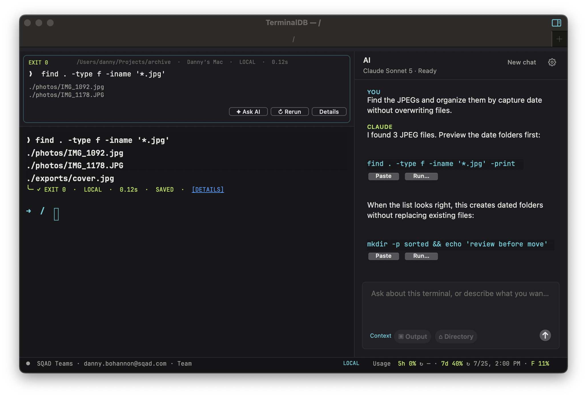

# TerminalDB

<p align="center">
  
</p>

<p align="center">
  <strong>A native macOS terminal with a context-aware Claude assistant and a local command ledger.</strong>
</p>

<p align="center">
  
  
  
  
</p>

TerminalDB combines an independent PTY-backed shell, a collapsible AI chat,
multiple isolated Claude Code accounts, live subscription-usage tracking, and
a searchable local record of completed commands. It is written directly
against AppKit and macOS system APIs with no Xcode project, package manager, or
runtime framework dependency.

> [!IMPORTANT]
> TerminalDB is early alpha software. Test it with non-critical workflows,
> review every generated command before running it, and read the
> [security and privacy](#security-and-privacy) section before adding an API
> key.



## Why TerminalDB?

Command-line work often alternates between understanding a system, composing a
command, running it, and interpreting the result. TerminalDB keeps that loop in
one native window:

- The terminal remains a normal interactive shell; natural-language detection
  never intercepts terminal input.
- AI chat receives the current directory and visible terminal output only when
  the user sends a message.
- Suggested shell commands have adjacent **Paste** and permission-gated
  **Run…** actions, so the relationship between command and action is explicit.
- Read-only questions can use a constrained inspection sidecar that reports
  the exact command, output, exit status, and duration.
- Every completed command becomes a structured block with output, target,
  environment, approval, status, timing, bookmarks, annotations, and actions.
- Claude Code accounts and Anthropic API credentials remain visibly separate.

## Features

### Native terminal sessions

- Independent login shell, PTY, working directory, foreground process, and
  scrollback for every tab
- UTF-8, ANSI/256/truecolor output, alternate-screen programs, bracketed paste,
  cursor modes, and xterm navigation keys
- Native macOS windows, tabs, and independent right/down split panes
- Event-driven tab titles for shell commands and Claude Code lifecycle states
- Graphite Ledger visual system with bundled JetBrains Mono

### Context-aware AI chat

- Collapsible right-side conversation pane with per-tab context
- Ongoing conversations that survive pane collapse
- **New chat** for a deliberate context reset
- Visible context chips for directory, terminal output, command blocks, and
  monitored work; removable attachments never hide what Claude can see
- Streamed Anthropic Messages API responses
- Model list loaded dynamically from Anthropic's Models API
- Graceful setup guidance when no API key or model is configured

### Permissioned command and patch workflow

- Separate inline **Paste** and **Run…** buttons for every shell code block
- Ask-before-running, validated-read-only, and paste-only permission modes
- Risk classification for read-only, unknown, write, destructive, remote, and
  production commands
- Target directory, host, environment, and risk shown before execution
- Production approval requires an acknowledgement and typed target
- Approval metadata recorded with the resulting command block
- Unified diff proposals have **Copy** and **Apply…** actions; apply first runs
  `git apply --check`, supports per-hunk selection, and then enters the normal
  permission flow
- The last approved AI patch remains available for validated reverse-apply
  during the current app session
- Read-only inspection commands run outside the interactive PTY
- Inspection output includes command, directory, exit code, duration, and
  truncation state
- Mutating or unsupported inspections are blocked and returned as suggestions

### Command ledger

- Live **READY**, **RUNNING**, and exit-state header above the terminal
- Current command, directory, inferred environment, exit status, and duration
- One-click **Ask AI**, **Explain / Fix**, **Paste**, **Rerun**, **Bookmark**,
  **Runbook**, **Details**, and **History** actions
- Search across commands, paths, output, projects, status, date, environment,
  and bookmarks
- Full inspector with metadata, output, approvals, annotations, related
  history, and JSON/text export
- Natural-language filter phrases, structured `status:`, `project:`, `host:`,
  and `env:` queries, reusable saved searches, and recent directories
- Local JSON persistence with bounded records and output
- Best-effort redaction of common API keys, bearer tokens, and password
  assignments before history is written

### Claude Code account management

- No application-imposed account limit
- A different Claude Code account can be selected for each terminal tab
- Add, sign in, switch, and remove profiles without changing another terminal
  application's Claude configuration
- Active account and subscription remain visible in the bottom status strip
- 5-hour, 7-day, and Fable usage with reported reset dates
- Usage refresh on demand and automatically every five minutes
- A dedicated account-and-usage window keeps the active account, plan,
  sign-in state, all profiles, usage, and reset details separate from API chat

### Workflows and project context

- Monitor Center follows running commands, retains completed output in memory,
  marks commands stalled after three minutes, and notifies on failures or
  commands lasting at least 30 seconds
- Parameterized multi-step runbooks can be created or edited, previewed,
  pasted for review, or sent through permissioned execution
- Workspaces save and restore tabs, splits, directories, Claude Code account
  selection, model, AI-pane state, and conversation context
- Nested split orientation is preserved, and workspaces can be renamed or
  deleted
- Restore conflicts default to opening a new window so current work is kept
- Project Tools provide Git status/diff, file inventory, and test actions
- Environment views explain local, SSH, container/Kubernetes, and production
  protection states
- Private Session keeps the active tab's new command blocks and workspace chat
  context out of persistent storage
- Eight-step first-run onboarding and twelve settings categories


## Project status

TerminalDB is under active development and currently targets developers
building the application from source. There is no notarized binary release,
automatic updater, migration guarantee, or stable public API yet.

The design source covers the broader product direction, interaction states,
menus, accessibility behavior, environment safety, history, runbooks, and
monitoring surfaces:

- [Interactive design export](Design/TerminalDB.dc.html)
- [App icon SVG master](Design/terminaldb-icon.svg)
- [Claude Design project](https://claude.ai/design/p/0e421271-5e0c-43e1-b34a-e52926506c66?file=TerminalDB.dc.html)

## Requirements

- macOS 13 Ventura or newer
- Apple Command Line Tools
- `zsh` as the interactive shell
- An Anthropic API key for AI chat
- Optional: [Claude Code](https://docs.anthropic.com/en/docs/claude-code/overview) for
  subscription-account isolation and usage tracking

Install the command-line tools if needed:

```sh
xcode-select --install
```

## Quick start

Clone, build, test, and launch:

```sh
git clone https://github.com/danb235/TerminalDB.git
cd TerminalDB
make
make test
open build/TerminalDB.app
```

During development, `make run` rebuilds and opens the app:

```sh
make run
```

The generated bundle is `build/TerminalDB.app`. It is ad-hoc signed for local
development. A distributed build should use an Apple Developer ID, hardened
runtime, notarization, and a release-specific bundle/version process.

## Configure AI chat

1. Open **TerminalDB → Settings…**, **AI → AI Chat Settings…**, or the gear
   in the AI pane.
2. Paste an Anthropic API key.
3. Choose **Save & Refresh**.
4. Select one of the models returned for that key.
5. Open the AI pane with the title-bar sidebar button or
   **Shift-Command-L**.

The selected model is also available under **AI → AI Chat Model**. Use
**Refresh Available Models** to load newly available models without updating
TerminalDB.

### API chat versus Claude Code

These are intentionally separate credentials and billing surfaces:

| Capability | Anthropic API key | Claude Code account |
| --- | --- | --- |
| Used for | TerminalDB's AI chat | `claude` sessions launched in a tab |
| Billing | Anthropic API usage | Claude subscription |
| Selection | One saved key and model | One profile per terminal tab |
| Storage | TerminalDB preferences | Isolated Claude config and Keychain item |
| Usage shown | Not currently shown | 5h, 7d, and Fable subscription windows |
| Removal effect | Disables API chat | Removes only that local TerminalDB profile |

Adding or removing one credential type never changes the other.

## Use Claude Code accounts

Open **AI → Claude Code Account for This Tab** to:

- select an existing account for the active tab;
- add and authenticate another account;
- sign back in when a profile expires; or
- remove the selected profile from TerminalDB.

Each profile receives a TerminalDB-owned `CLAUDE_CONFIG_DIR`. This isolates its
settings and credential from other TerminalDB profiles and from Claude Code
running in Terminal, iTerm, or another application.

The bottom status strip always shows the active account and subscription.
Selecting the strip opens a compact account switcher and usage summary.
Reported 5-hour and 7-day reset timestamps are shown only as future resets;
stale past timestamps are labeled as ended until refreshed.

Removing a profile deletes its local TerminalDB Claude configuration and
TerminalDB-specific credential after confirmation. It does **not** cancel the
Claude subscription or change billing.

## Command ledger and history

TerminalDB installs temporary zsh lifecycle hooks for its own PTY. A pre-exec
marker starts a command record, and the next prompt supplies the exit code and
finishes it. Normal shell behavior and the user's persistent shell
configuration remain in control.

Completed records contain:

- command text;
- working directory;
- captured output;
- exit code and duration;
- timestamp, host, and inferred environment; and
- a stable record identifier.

Open **View → Command History** or press **Command-Y** to search and inspect
records. Clearing TerminalDB history does not change `.zsh_history`.

## Keyboard shortcuts

| Action | Shortcut |
| --- | --- |
| New window | Command-N |
| New tab | Command-T |
| Split right | Command-D |
| Split down | Shift-Command-D |
| Close tab | Command-W |
| Close window | Shift-Command-W |
| Show or hide AI chat | Shift-Command-L |
| Command history | Command-Y |
| Runbooks | Shift-Command-R |
| Clear scrollback | Command-K |
| Settings | Command-, |
| Increase terminal text | Command-+ |
| Decrease terminal text | Command-minus |
| Reset terminal text | Command-0 |
| Previous tab | Shift-Command-[ |
| Next tab | Shift-Command-] |

## Architecture

TerminalDB deliberately keeps its implementation small and inspectable:

| Component | Responsibility |
| --- | --- |
| `src/main.m` | App lifecycle, PTY, terminal parser/renderer, tabs, menus, shell integration |
| `src/ClaudeAssistantView.*` | AI conversation UI, streaming transcript, inline command actions |
| `src/ClaudeAPI.*` | API-key configuration, dynamic models, Anthropic message streaming |
| `src/TerminalInspector.*` | Read-only command validation and sandboxed inspection |
| `src/ClaudeProfile.*` | Isolated Claude Code profiles and local profile persistence |
| `src/ClaudeStatusBar.*` | Active account, sign-in state, usage normalization and refresh |
| `src/TerminalLedger.*` | Command lifecycle header, redacted history store, history window |
| `src/TerminalPermissions.*` | Risk classification, approvals, and production confirmation |
| `src/TerminalProduct.*` | Runbooks, monitors, workspaces, project/environment/settings views |
| `src/TerminalTheme.*` | Graphite Ledger colors, type, and terminal appearance |
| `Resources/` | Font, license, icon, and shell bridge assets |
| `Design/` | Interactive product design and visual QA artifacts |

The build uses `clang`, AppKit, Foundation, and system pseudo-terminal APIs
directly. There is no generated Xcode project or third-party runtime library.

## Data storage

TerminalDB does not provide cloud synchronization. Local application data is
scoped to the current macOS account.

| Data | Location | Notes |
| --- | --- | --- |
| API key and selected model | TerminalDB `NSUserDefaults` preferences | Key is masked in the UI but is not Keychain-protected |
| Command ledger | `~/Library/Application Support/TerminalDB/command-history.json` | Mode `0600`, capped at 5,000 records |
| Runbooks and workspaces | `~/Library/Application Support/TerminalDB/product-state.json` | Local persistent workflow state |
| Claude profiles | `~/Library/Application Support/TerminalDB/ClaudeProfiles/` | Separate configuration directory per profile |
| Claude Code credentials | macOS Keychain | Created and read through the profile's Claude Code flow |
| Temporary shell markers | A TerminalDB-created temporary directory | Removed with the terminal session |

## Security and privacy

Terminal software and AI-assisted command generation both operate near
sensitive data. TerminalDB's current safeguards are designed to reduce risk,
not eliminate it.

### Command execution boundaries

- AI-generated commands are never executed by the **Paste** action.
- **Run…** applies the selected permission mode and shows a target/risk review
  unless the user explicitly enabled validated-read-only execution.
- Destructive and production commands never receive reusable approvals.
- Automatic inspections accept only a constrained read-only command set.
- Inspections run under `sandbox-exec` with file writes and network access
  denied.
- Inspection processes use a bounded environment, output limit, and duration.
- The interactive shell remains separate from inspection processes.

### Context sent to Anthropic

When an AI message is sent, TerminalDB includes the active tab's current
directory and visible terminal output plus any removable context chips shown
in the composer. That content may include source code, paths, command output,
or secrets already visible in the terminal. Review the chips and screen before
sending and follow your organization's data-handling policy.

Terminal output is marked as untrusted reference data in the system prompt,
but prompt injection remains possible. Treat generated advice and commands as
untrusted until reviewed.

### Local secrets

The Anthropic API key is persisted in TerminalDB preferences so local
development builds do not repeatedly trigger Keychain authorization dialogs.
The field is visually masked, and the value is excluded from project files,
logs, shell integration, and the command ledger. Anyone who can read the
macOS account's preferences may still recover it.

The ledger applies best-effort secret redaction before writing records.
Redaction cannot recognize every secret format. Avoid printing secrets to the
terminal, clear the ledger after sensitive work, and rotate any credential
that may have been exposed.

### Vulnerability reports

Do not disclose a suspected vulnerability in a public issue. Use GitHub's
private vulnerability-reporting or Security Advisory flow when it is enabled
for the repository, or contact the repository owner privately.

## Build and test

Available Make targets:

```sh
make                 # Build the app bundle
make run             # Build and launch
make test            # Run all self-tests and background integration QA
make qa-signature    # Verify the development signature requirement
make qa-tabs         # Exercise tabs, shells, titles, menus, and AI pane
make qa-claude-state # Exercise Claude Code lifecycle bridge behavior
make clean           # Remove the generated build directory
```

`make test` covers terminal parsing and cursor behavior, split UTF-8 input,
clipboard and control-key behavior, output following, code-block extraction,
AI transcript and terminal context, inspection validation and rendering,
per-command Paste/Run and patch actions, permission risk classification,
ledger redaction/environment handling, runbook/workspace/monitor persistence,
usage normalization, profile authentication/removal, code signing, and
background AppKit tab integration.

QA app processes use accessory activation and keep their windows behind the
active application.

## Terminal compatibility

TerminalDB reports `TERM=xterm-256color` and implements a practical everyday
xterm/iTerm-style baseline:

- UTF-8, ANSI colors, 256 colors, and truecolor
- cursor movement, erasing, and in-place TUI redraws
- primary and alternate screen switching
- normal and application cursor keys
- xterm function and navigation keys
- selection, clipboard copy/paste, and bracketed paste
- PTY resizing with `SIGWINCH`
- OSC 0/1/2 application and window titles
- automatic output following with preserved user scrollback

Known compatibility gaps include mouse-reporting protocols, complete DEC
scrolling-region semantics, exhaustive Unicode cell-width handling,
hyperlinks, and inline images.

## Troubleshooting

### No models appear

Confirm the API key is valid, select **Save & Refresh**, then use
**AI → AI Chat Model → Refresh Available Models**. The models endpoint may
return a different set for different Anthropic accounts.

### AI chat says setup is required

Open **TerminalDB → Settings…** and verify that both an API key and model are
configured. Claude Code subscription sign-in does not configure API chat.

### Claude Code is signed out

Choose the profile under **AI → Claude Code Account for This Tab**, then
select **Sign In to _Profile_…**. Other tabs keep their existing account.

### Usage is unavailable or stale

Use **AI → Refresh Claude Code Usage** or select the bottom status strip.
TerminalDB reads Claude Code status data and also uses Anthropic's currently
undocumented OAuth usage endpoint as a best-effort source. Service changes may
temporarily make usage unavailable without affecting the subscription itself.

### The app is blocked after downloading a build

The current project produces a local ad-hoc-signed development bundle, not a
notarized public release. Build from source. Do not bypass Gatekeeper for an
untrusted binary.

## Design and accessibility

Graphite Ledger is TerminalDB's own visual system: deep graphite surfaces,
cyan context signals, acid-lime live/success states, amber warnings, and coral
failures. Terminal and command metadata use bundled JetBrains Mono under the
SIL Open Font License.

The design target includes keyboard access, explicit focus indicators, text
alternatives for color-coded states, VoiceOver labels for icon-only controls,
reduced-motion behavior, and a compact layout that preserves terminal
readability. Accessibility issues are treated as product bugs.

## Contributing

Contributions will be welcome once the repository is opened publicly.

Before proposing a change:

1. Search existing issues and discussions.
2. Keep changes focused and preserve normal PTY behavior.
3. Do not commit API keys, access tokens, captured user output, or personal
   Claude profile data.
4. Run `make test`.
5. Include manual QA notes for terminal, account, usage, or accessibility
   changes.
6. Update documentation when behavior, storage, or security boundaries change.

Code should compile cleanly with `-Wall -Wextra`, use AppKit conventions, avoid
new dependencies unless they materially improve the product, and include a
proportionate regression test.

## Roadmap

- virtualized structured command blocks embedded throughout terminal
  scrollback rather than only the active ledger header and history window;
- interactive agent responses to long-running process prompts and notification
  actions;
- richer multi-file editing, conflict resolution, and durable revert
  checkpoints across app launches;
- optional encrypted sync and team-shared runbook governance;
- release signing, notarization, updates, migration tooling, and crash
  diagnostics; and
- broader terminal-protocol compatibility.

## License

TerminalDB is available under the [MIT License](LICENSE).

## Acknowledgements

- [Anthropic](https://www.anthropic.com/) for Claude and Claude Code
- [JetBrains Mono](https://www.jetbrains.com/lp/mono/) for the bundled terminal
  font
- The macOS AppKit, Foundation, and POSIX terminal APIs
